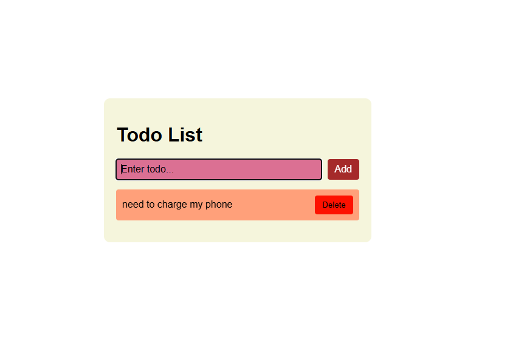

# To-Do List Application  

A simple, interactive, and responsive To-Do List web application built using **HTML**, **CSS**, and **JavaScript**. This project helps users organize their tasks effectively and improve productivity.

---

## 🚀 Features  
- **Add Tasks**: Quickly add tasks to your to-do list.  
- **Mark Tasks as Complete**: Check off tasks when done.  
- **Delete Tasks**: Remove tasks no longer needed.  
- **Responsive Design**: Optimized for desktop and mobile devices.  

---

## 📸 Preview  
  

---

## 🛠️ Technologies Used  
- **HTML**: For the structure of the application.  
- **CSS**: For styling and responsive design.  
- **JavaScript**: For dynamic interactivity and functionality.  

---

## 💡 How to Use  
1. Clone the repository:  
   ```bash  
   git clone https://github.com/kabilesh1234/Todo-list-using-html-css-and-javascript.git
2. Navigate to the project directory:
cd  Todo-list-using-html-css-and-javascript
3. Open the index.html file in your browser to view the app.

---
## 📂 Project Structure
📁 todo-list  
├── 📄 index.html  # Main HTML file  
├── 📄 style.css   # CSS file for styling  
├── 📄 script.js   # JavaScript file for functionality  
└── 📁 assets      # Folder for images 

---
## 🌟 Future Enhancements
- Add task categories for better organization.
- Implement local storage to save tasks between sessions.
- Add a dark mode toggle for better user experience.

---
## 🙌 Contributing
Contributions are welcome! Feel free to fork the repository and submit a pull request.

---
## 📄 License
This project is licensed under the MIT License. You are free to use, modify, and distribute it.

-- 💌 Contact
For questions or feedback, feel free to reach out:

-GitHub: Kabilesh1234
-Email: kabilesh455@gmail.com
